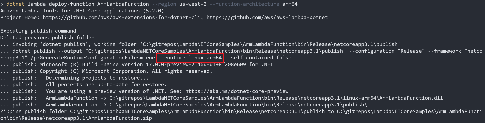
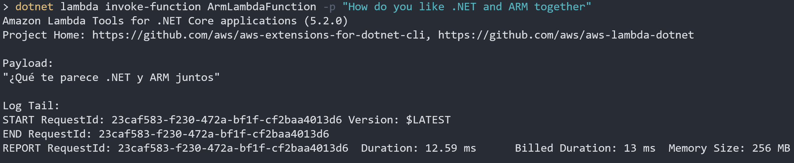
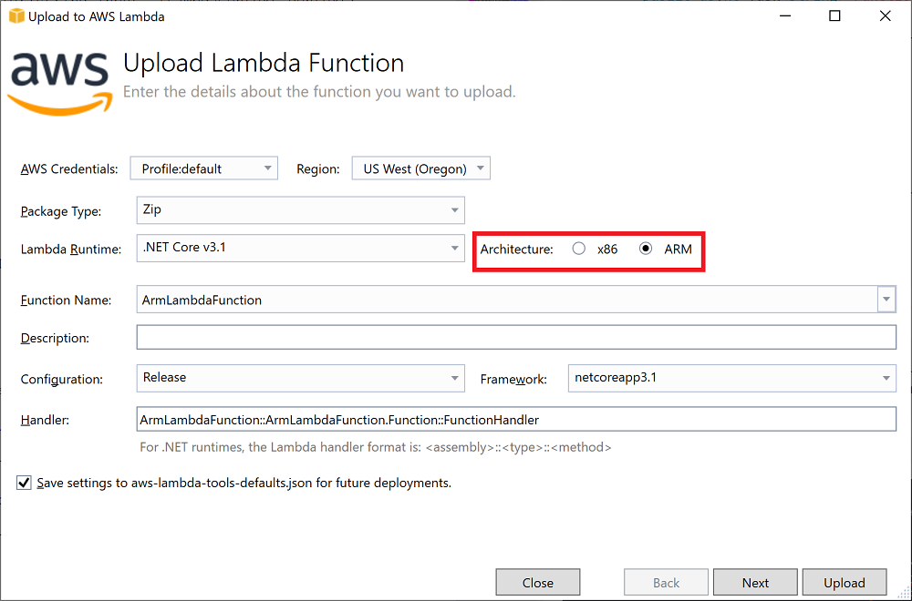

# .NET Lambda Function with ARM

On September 29th 2021 AWS Lambda [released support](https://aws.amazon.com/blogs/aws/aws-lambda-functions-powered-by-aws-graviton2-processor-run-your-functions-on-arm-and-get-up-to-34-better-price-performance/) for Arm based Lambda functions using AWS's 
Graviton2 cpu architecture. Arm based Lambda functions get to take advantage of the efficiency of the Graviton2 cpu architecture and also get a 20% price reduction in duration charges.

## Packaging .NET Lambda Functions
To optimize deployment bundle size the AWS .NET Lambda tools have always packaged up .NET Lambda functions 
setting a runtime identifier (RID). Starting with .NET Core 3.1 the RID has been set to `linux-x64`.
This is done so that the deployment bundle only includes the dependencies needed for running in Lambda.
Otherwise the deployment bundle would include dependencies for all possible platform.

Now that Arm exists the RID needs to be set to `linux-arm64` when using Arm. Using the Lambda .NET CLI
[Amazon.Lambda.Tools](https://www.nuget.org/packages/Amazon.Lambda.Tools/) the 
`--function-architecture` switch can be set to `arm64` which means the underlying call to 
`dotnet publish` will use the `linux-arm64` RID and tell Lambda to deploy as Arm.

As with all command line switches for Amazon.Lambda.Tools you can also set the architecture 
in **aws-lambda-tools-defaults.json** using the `function-architecture` property.

```json
{
...
  "configuration": "Release",
  "function-runtime": "provided.al2",
  "function-architecture": "arm64",
  "function-memory-size": 256,
  "function-timeout": 30,
...
}
```

If you are deploying via a CloudFormation template then the RID for the `dotnet publish` command is 
inferred from the template by setting the `Architectures` property on your `AWS::Lambda::Function`
or `AWS::Serverless::Function` resources.

Because previous deployments were deployed using the `linux-x64` RID you can not simply change the 
architecture of an existing Lambda function. You have to redeploy with a new deployment bundle 
with the `linux-arm64` RID.

## Container based Arm Lambda Functions

Currently AWS provides a .NET Core 3.1 Arm based image for Lambda functions deployed as container. 
The existing [public.ecr.aws/lambda/dotnet:core3.1](https://gallery.ecr.aws/lambda/dotnet) 
tag has changed to be a multi architecture tag. So depending on the architecture you want to build the 
correct architecture image will be used.

To build an Arm based image on a non-arm platform like Windows you have to use the `docker buildx` command.
Assuming you are using the AWS .NET Lambda tooling to do the build and deployment it
will automatically switch to using `docker buildx` when `--function-architecture` is set
to `arm64`.


## .NET 5 and 6 with Custom Runtimes

If you want to use .NET 7 on Lambda today you would use Lambda custom runtime support. I 
previously talked about how to use .NET 7 and custom runtimes [here](https://github.com/normj/LambdaNETCoreSamples/tree/master/CustomRuntimeListBucketsNET7).

As of the time of writing there is an issue when deploying .NET custom runtime Lambda functions 
with Arm due to .NET requiring version 53 of the native dependency libicu for Arm and Amazon Linux 2 has 
version 50. You can track this issue [here](https://github.com/aws/aws-lambda-dotnet/issues/920). Luckily
there is an easy work around by including a newer version of libicu with your Lambda functions.

In your `csproj` or `fsproj` file add the following `ItemGroup` to your project file. This 
tells the .NET runtime to use `Microsoft.ICU.ICU4C.Runtime` for unicode and globalization support 
instead of a local libicu native dependency.

```xml
<ItemGroup>
    <RuntimeHostConfigurationOption Include="System.Globalization.AppLocalIcu" Value="68.2.0.6" />
    <PackageReference Include="Microsoft.ICU.ICU4C.Runtime" Version="68.2.0.6" />
</ItemGroup>
```
Also be sure the Lambda runtime is set to `provided.al2` instead of `provided`. The 
custom runtime blueprints were recently changed to default to `provided.al2`.

## Example Deployment

Since the program model hasn't changed for Arm there isn't anything new to learn. For demonstration
purposes this folder contains a .NET Core 3.1 Lambda function that translates English input to 
Spanish using the **AWSSDK.Translate** NuGet package.

```csharp
using System.Threading.Tasks;

using Amazon.Lambda.Core;
using Amazon.Translate;
using Amazon.Translate.Model;

// Assembly attribute to enable the Lambda function's JSON input to be converted into a .NET class.
[assembly: LambdaSerializer(typeof(Amazon.Lambda.Serialization.SystemTextJson.DefaultLambdaJsonSerializer))]

namespace ArmLambdaFunction
{
    public class Function
    {
        IAmazonTranslate _translateClient = new AmazonTranslateClient();

        public async Task<string> FunctionHandler(string input, ILambdaContext context)
        {
            var response = await _translateClient.TranslateTextAsync(new TranslateTextRequest
            {
                SourceLanguageCode = "en",
                TargetLanguageCode = "es",
                Text = input
            });

            return response.TranslatedText;
        }
    }
}
```

To deploy this to Lambda from the CLI install the Amazon.Lambda.Tools and use the `deploy-function` command.

```
dotnet tool install -g Amazon.Lambda.Tools
dotnet lambda deploy-function ArmLambdaFunction --function-architecture arm64
```

In the output window you can see the `dotnet publish` command with the `linux-arm64` RID.



To test it out from the command line I can use the `invoke-function` command.



For this very simple Lambda function the cold and warm starts are equivalent. So by just switching my
function to Arm I save myself 20% in Lambda duration cost. 

### Visual Studio users

You can also deploy Arm based .NET Lambda functions in Visual Studio using the 
[AWS Toolkit for Visual Studio](https://marketplace.visualstudio.com/items?itemName=AmazonWebServices.AWSToolkitforVisualStudio2017). 
In the latest version you can 
now set the architecture to Arm through the Lambda deployment wizard. It is as simple as that and 
then you get the cost savings of Arm/Graviton2.

